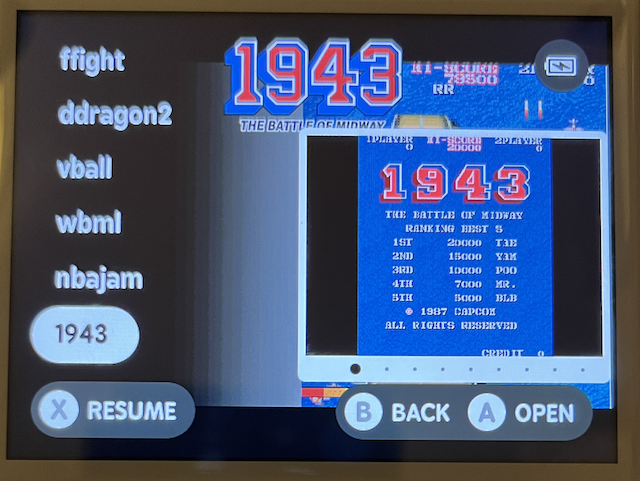
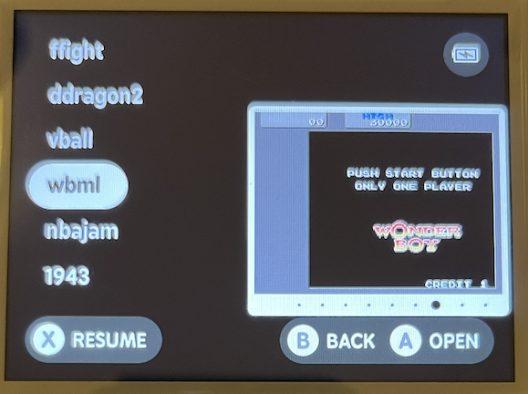

Update 01-05-2024

as FinUI has been closed, even this repo won't be updated anymore.
Anyway I moved to a new project based on latest MinUI called MyMinUI https://github.com/Turro75/MyMinUI/releases/tag/MyMinUI-20240501b which also supports the Miyoo Mini Plus.
There is also a plan to extend the support to rg353 family, let's see.

Update 03-04-2024

Added boxart and savestate from main menu

Some fancy additions to the minui app:
- Added BoxArt to main menu (see below for details)
- in case a savestate is present for the currently selected rom the same graphic state selector available in the menu game appears, select the one You want then press X.
- modified the meaning of the left and right d-pad buttons (previously next-previous page) now they allow to select across the state slots
- function next-previous page moved to L2 - R2 buttons. 

BoxArt:
I set the software to use the same garlicos specs:
create a folder called Imgs on each rom directory, the file type must be png, having the same rom name without original extension
i.e. the rom "Castelvania - Aria of Sorrow (USA).zip" must have a boxart file in "Imgs/Castelvania - Aria of Sorrow (USA).png"
As per garlicos the file must be 640x480. For best results I suggest to use these skraper settings [https://github.com/timault/Garlic-Os-Skraper-](https://github.com/timault/Garlic-Os-Skraper-) 

Example of a Rom with boxart and save state available:

Example of a Rom with boxart and no save state available:

Example of a Rom without boxart and save state available:

# MyFinUI

MyFinUI is a fork of [FinUI](https://github.com/robshape/FinUI). MinUI is
a focused custom launcher for the Anbernic RG35XX. FinUI adds additional features
on top of MinUI. MyFinUi adds more features to FinUI:

1)  added Retroarch 1.14 as alternative libretro frontend for cores it has the same video filters available on garlicos.
2)  added prboom libretro core (Doom), it works only with retroarch as libretro frontend
3)  added puae2021 libretro core (Amiga), not really tested, expect issues, please report
4)  added FinalBurnNeo libretro core, it works surprisingly well on some arcade game which are slow on other OS, use
    an FBNeo romset as many 0.78 roms (mame2003+) don't work well.
5)  replaced dinguxcommander with the garlicos version (source rg35xx.com) which has more features
6)  added input tester (source latest MinUI)
7)  reduced footprint of the docker toolchain from 4.5GB down to 1.5GB.
8)  the power button now perform a shutdown as garlicos 1.4.9 does instead of standby
9)  various improvements on makefiles
10) to use retroarch instead of minarch just copy to the ROMS/Extras/Emus/xxxx.pak the launch.sh from ROMS/Extras/Emus/Doom.pak then set the right core name and the cpu speed required.

# FinUI

# FinUI

FinUI is a fork of [MinUI](https://github.com/shauninman/union-minui/). MinUI is
a focused custom launcher for the Anbernic RG35XX. FinUI adds additional features
on top of MinUI.

## Features

### MinUI features

- Simple launcher, simple SD card
- No settings or configuration
- No boxart, themes, or distractions
- Automatically hides extension
  and region/version cruft in
  display names
- Consistent in-emulator menu with
  quick access to save states, disc
  changing, and emulator options
- Automatically sleeps after 30 seconds
  or press POWER to sleep (and wake)
- Automatically powers off while asleep
  after two minutes or hold POWER for
  one second
- Automatically resumes right where
  you left off if powered off while
  in-game, manually or while asleep
- Resume from manually created, last
  used save state by pressing X in
  the launcher instead of A
- Streamlined emulator frontend
  (minarch + libretro cores)

### Additional FinUI features

- Add to Favorites
- Clear "Recently Played"
- Power saving improvements
- Performance improvements
- Multi-core CPU support
- Battery reading adjustments
- Additional emulators (MAME)
- Base and Extras are merged into one Full release
- Native macOS installation instructions
- Developer experience improvements

## Development

### Prerequisites

- [Docker Desktop](https://docker.com/products/docker-desktop/)

### Build project

Run `./start-toolchain.sh` and then run `make all` in the Docker container shell.

### Debug project

Create a file with the name `enableADB` on the `misc` disk to enable ADB.

### Install release

Update `DISK_PATH` and then run `./install-release.sh`.

## Disclaimer

This software is provided without warranty of any kind. In no event shall the authors
or contributors be liable for any claim, damages, or other liability, arising from,
out of, or in connection with this software, the use of this software, or other
dealings with this software.

Use at your own risk.
